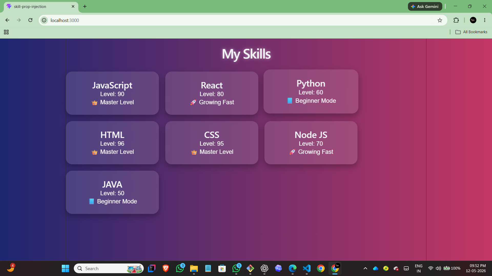
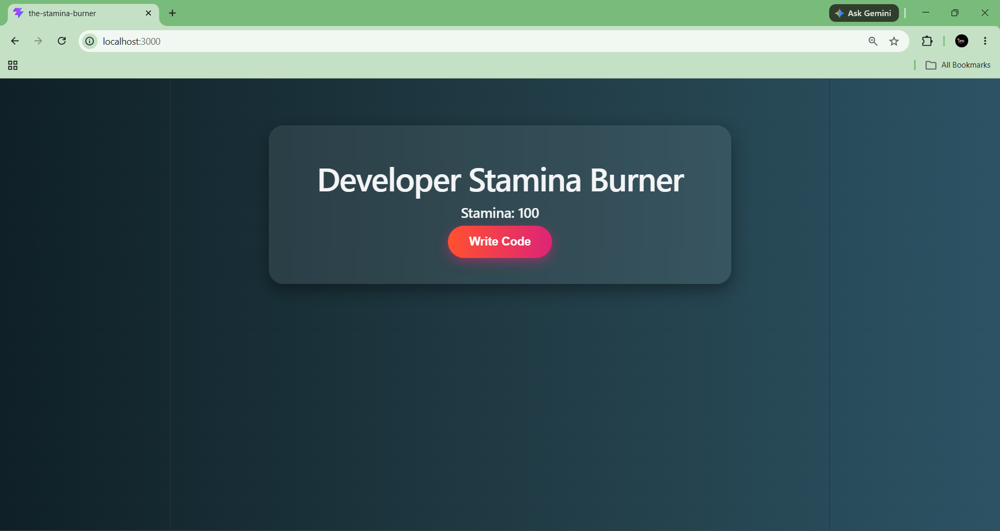

# 📑 Daily Task Submission Report
**MERN Stack Internship | Prelytix Private Limited**

| Field | Details |
| :--- | :--- |
| **Student Name** | Sahil Belim |
| **Internship ID** | ND |
| **Date** | 2026-05-12 |
| **Course Day** | Day 1 |
| **GitHub Repo** | https://github.com/sahil2877/MERN_Internship |

---

## 🎯 Daily Objective

> Today I worked on setting up a React project using Vite and created a Developer Stamina Dashboard. I implemented React components, props passing, conditional rendering, and stamina state management logic.

---

## 🛠️ Implementation & Changes (Self-Documentation)

### 1. New Features / Logic Implemented

- **What:** Implemented Skill Prop Injection and Stamina Burner logic using React.

- **How:** Created reusable React components such as SkillList and SkillBadge. Passed skill data using props and rendered dynamic cards using the map() method. Implemented stamina state management using useState and added special modulus logic for every 5th click stamina reduction.

- **Why:** To understand component communication, dynamic rendering, conditional rendering, and state updates in React applications.

---

### 2. UI/UX Enhancements

- Designed custom UI for both Skill Prop Injection and Stamina Burner sections using separate CSS files.
- Added modern card layouts with border radius, spacing, shadows, and hover effects.
- Used different background styles and color combinations to improve the dashboard appearance.
- Added interactive hover animations on skill cards and buttons.
- Styled the stamina button with transition effects, scaling animation, and disabled state styling.
- Improved responsiveness and alignment for cleaner UI presentation.

---

### 3. Database / Backend Updates

- No backend or database implementation was required for Day 1 tasks.

---

## 💻 Code Snippet: My Primary Contribution

```javascript
function handleCodeClick() {

    const nextClick = clickCount + 1;

    setClickCount(nextClick);

    let newStamina;

    if (nextClick % 5 === 0) {

        newStamina = stamina - 15;

    } else {

        newStamina = stamina - 2;
    }

    if (newStamina < 0) {
        newStamina = 0;
    }

    setStamina(newStamina);
}

````

---

## 📸 Screenshots / Proof of Work


> **Skill Section Screenshot:**
> 

> **Stamina Burner Screenshot:**
> 

---

## 🛑 Challenges Faced & Solutions

* **Problem:** The Vite application was initially running on a different port instead of localhost:3000.

* **Solution:** Updated the vite.config.js file and manually configured the server port to 3000.

* **Problem:** CSS styling looked too basic at first.

* **Solution:** Improved the UI using custom styling, spacing, hover effects, shadows, and better button design.

---

## 💡 Key Learnings

* Learned how to pass data between React components using props.
* Understood how React state updates work using useState.
* Learned how to use conditional rendering and modulus operator logic in React.
* Improved understanding of component-based UI structure and CSS styling.

---

## 🔗 Live Preview (If applicable)

* **Deployment Link:** Not deployed yet.

---

**Signature:**
*sahil✒️*
*Sahil Belim*

```
```
