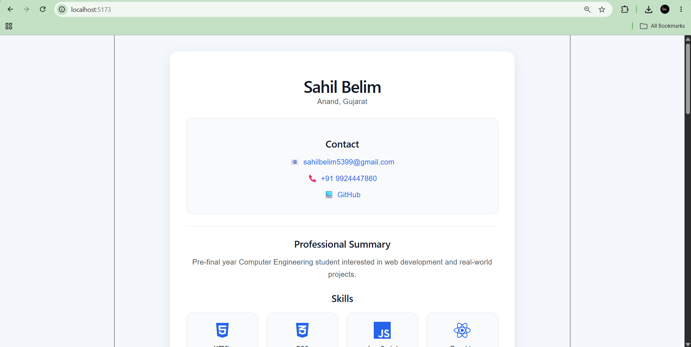
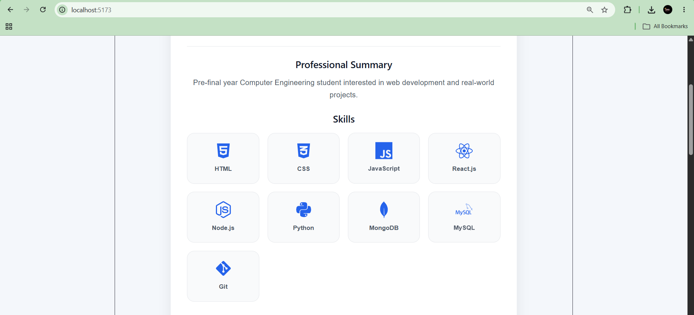
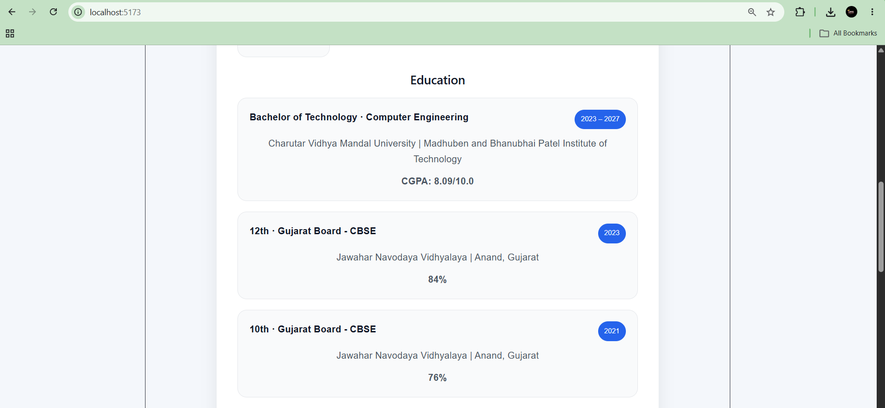
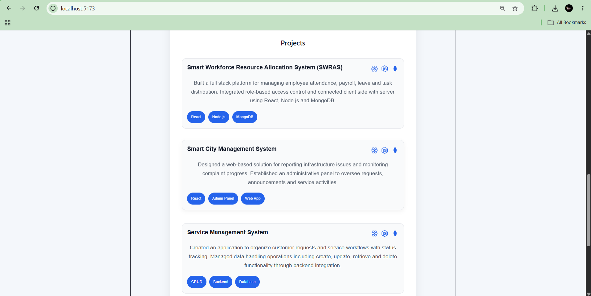
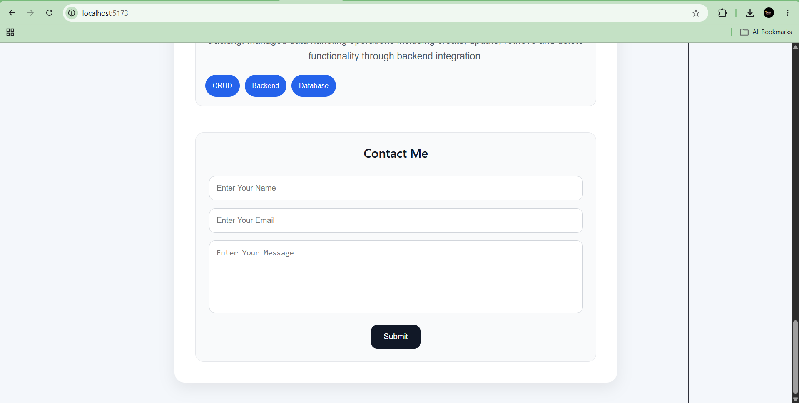
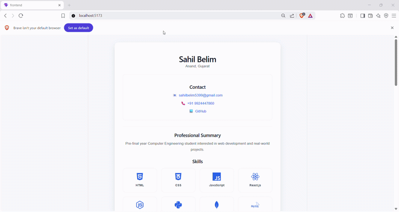

# 📑 Daily Task Submission Report
**MERN Stack Internship | Prelytix Private Limited**

| Field | Details |
| :--- | :--- |
| **Student Name** | Sahil Belim |
| **Internship ID** | ND |
| **Date** | 2026-05-16 |
| **Course Day** | Day 5 |
| **GitHub Repo** | https://github.com/sahil2877/MERN_Internship |

---

## 🎯 Daily Objective

Create a professional React-based Resume Portfolio UI with reusable components, responsive layout, project cards, skills section with icons, and a contact form for user interaction.

---

## 🛠️ Implementation & Changes (Self-Documentation)

### 1. New Features / Logic Implemented

- **What:** Built a React Resume Portfolio application using reusable components.

- **How:**  
Created separate React components for:
  - Skills Section
  - Education Section
  - Projects Section
  - Contact Details
  - Contact Form

Used `useState` for handling user input in the contact form and mapped dynamic arrays for rendering skills and projects.

- **Why:**  
To create a modular, maintainable and scalable React application following component-based architecture.

---

### 2. UI/UX Enhancements

- Added modern card-based UI.
- Added hover effects and transitions.
- Implemented responsive layout for mobile devices.
- Added professional skills cards with technology icons.
- Designed clean project cards with tech stack badges.
- Added styled contact form with focus effects.

---

### 3. Database / Backend Updates

- No backend/database integration added in this task.
- Frontend-only React portfolio implementation completed.

---

## 💻 Code Snippet: My Primary Contribution

```javascript
const skills = [
  {
    name: "React.js",
    icon: <FaReact />,
  },

  {
    name: "Node.js",
    icon: <FaNodeJs />,
  },
];

{
  skills.map((skill, index) => (
    <div className="skillCard" key={index}>
      <div className="skillIcon">
        {skill.icon}
      </div>

      <p>{skill.name}</p>
    </div>
  ));
}
```

---

## 📸 Screenshots / Proof of Work

> **Home / Resume UI Screenshot:**  
> 

> **Skills Section Screenshot:**  
> 

> **Education Section Screenshot:**  
> 

> **Projects Section Screenshot:**  
> 

> **Contact Form Screenshot:**  
> 

> **Complete Resume GIF Preview:**  
> 

---

## 🛑 Challenges Faced & Solutions

- **Problem:** Icons were not rendering in the React project.

- **Solution:**  
Installed `react-icons` package using:

```bash
npm install react-icons
```

and imported required icons inside components.

---

- **Problem:** Managing large UI code inside a single file.

- **Solution:**  
Separated the application into reusable React components for better readability and scalability.

---

## 💡 Key Learnings

- Learned component-based architecture in React.
- Learned dynamic rendering using `.map()`.
- Learned usage of `react-icons`.
- Improved understanding of responsive UI design.
- Learned state handling using `useState`.

---

## 🔗 Live Preview (If applicable)

- **Deployment Link:** https://your-link-here.vercel.app

---

**Signature:**  
*Sahil Belim*