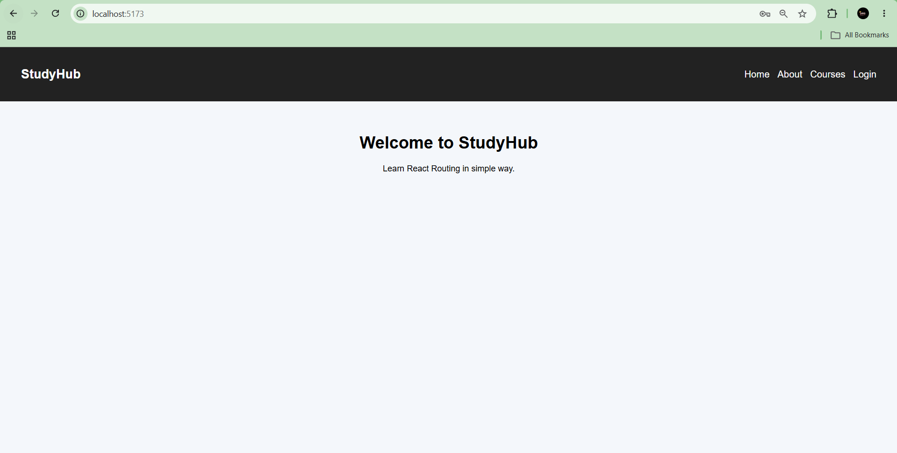
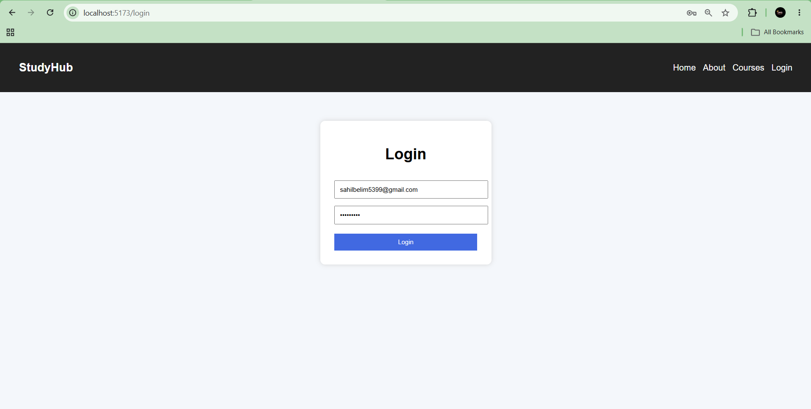
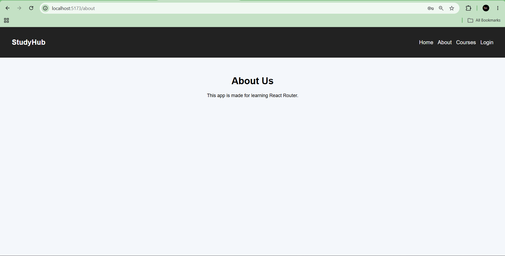
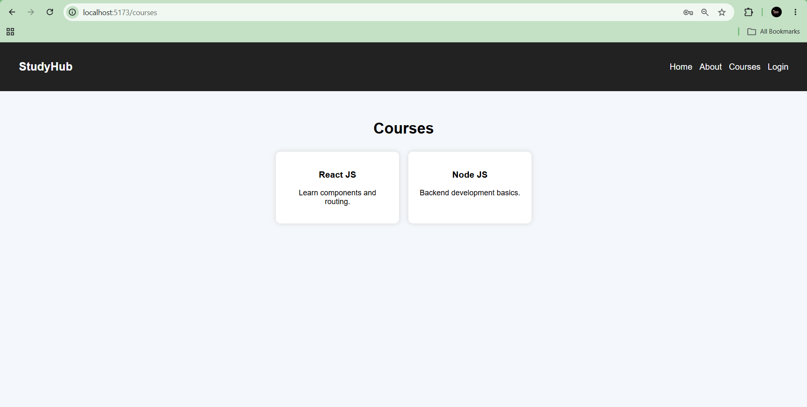

# 📑 Daily Task Submission Report
**MERN Stack Internship | Prelytix Private Limited**

| Field | Details |
| :--- | :--- |
| **Student Name** | Sahil Belim |
| **Internship ID** | ND |
| **Date** | 2026-05-14 |
| **Course Day** | Day 3 |
| **GitHub Repo** | https://github.com/sahil2877/MERN_Internship |

---

# 🎯 Daily Objective

Today’s objective was to learn React Routing using `react-router-dom` and create a multi-page React application with navigation, protected routes, redirects, and login/logout functionality.

---

# 🛠️ Implementation & Changes (Self-Documentation)

## 1. New Features / Logic Implemented

- **What:** Implemented React Routing with protected pages.
  
- **How:**  
  Used `react-router-dom` package and implemented:
  - `Routes`
  - `Route`
  - `Navigate`
  - `NavLink`
  - `useNavigate`

  Created pages:
  - Home
  - About
  - Courses
  - Login
  - Dashboard

  Added login state management using `useState`.

- **Why:**  
  To understand practical routing flow in React applications and learn how authenticated routes work.

---

## 2. UI/UX Enhancements

- Created a clean modern navbar UI.
- Added responsive spacing and card layouts.
- Designed a simple login form.
- Added clean button styling and page layouts.
- Implemented conditional navbar rendering based on login state.

---

## 3. Database / Backend Updates

- No backend integration was used today.
- Authentication was simulated using React state management.

---

# 💻 Code Snippet: My Primary Contribution

```javascript
<Route
  path="/dashboard"
  element={
    isLogin
      ?
      <Dashboard />
      :
      <Navigate to="/login" />
  }
/>
```


This protected route only allows logged in users to access the Dashboard page. Unauthorized users are redirected to Login page.

---

# 📸 Screenshots / Proof of Work

## UI Screenshot

> 

## Login Page Screenshot

> 

## About Page Screenshot

> 

## Cources Page screenshot

> 

---

# 🛑 Challenges Faced & Solutions

* **Problem:**
  `react-router-dom` import error occurred while running the project.

* **Solution:**
  Installed the package using:

```bash
npm install react-router-dom
```

Also wrapped the App component inside `BrowserRouter` in `main.jsx`.

---

# 💡 Key Learnings

* Learned how React Routing works.
* Understood navigation between pages.
* Learned protected routing using `Navigate`.
* Learned how to redirect users programmatically using `useNavigate`.
* Understood conditional rendering in navbar.

---

# 🔗 Live Preview (If applicable)

* **Deployment Link:** Not deployed yet.

---

**Signature:**
*Sahil Belim*`


```
