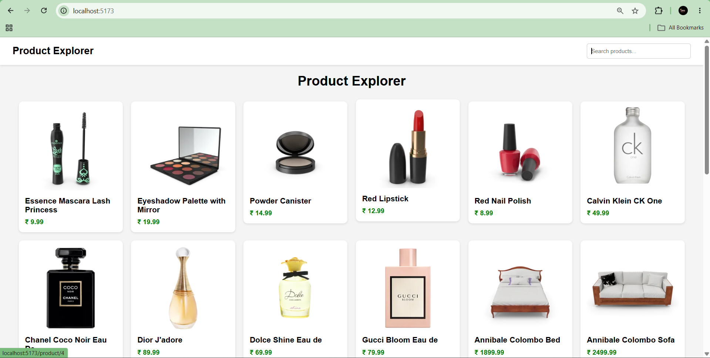
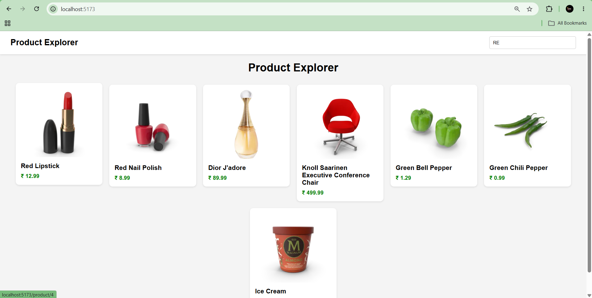
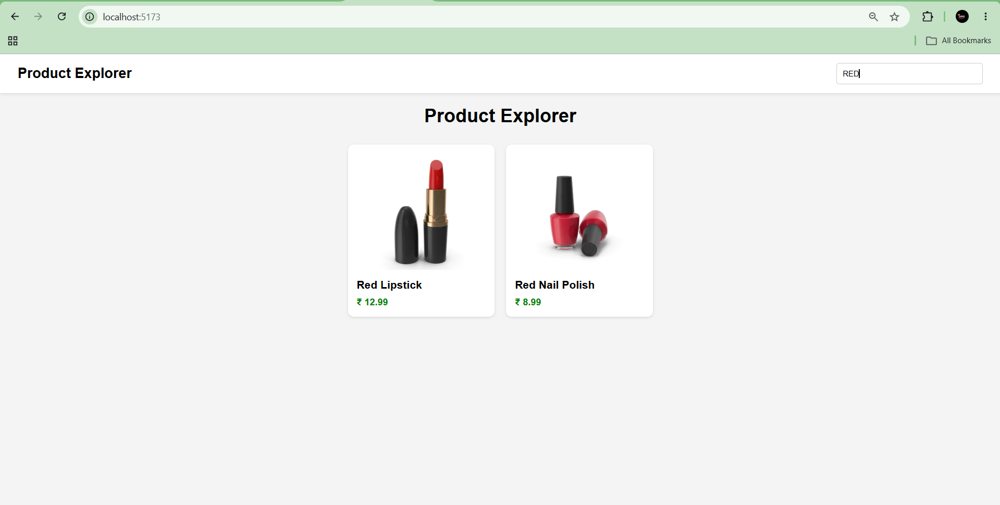
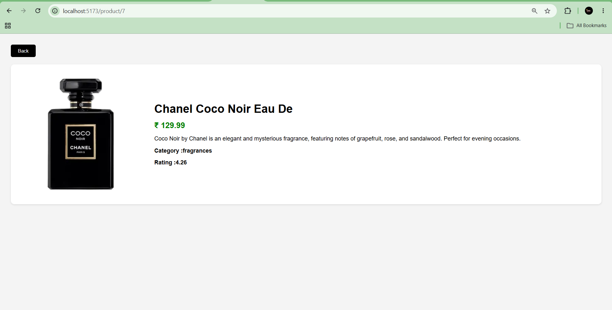
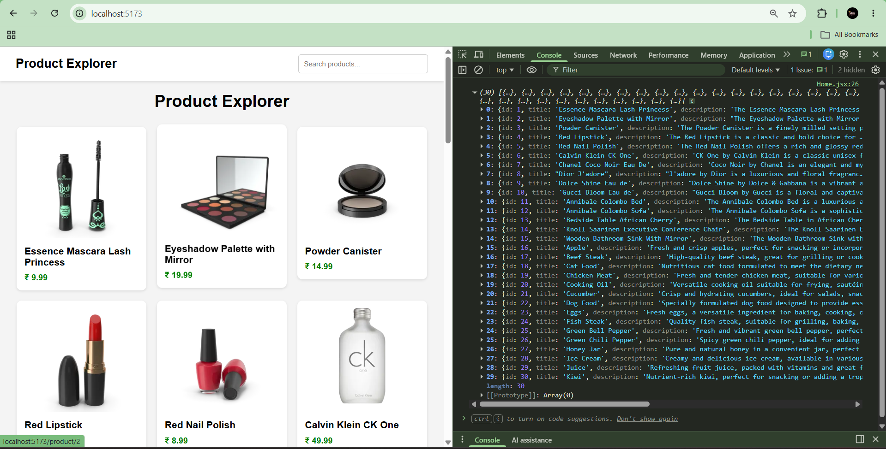
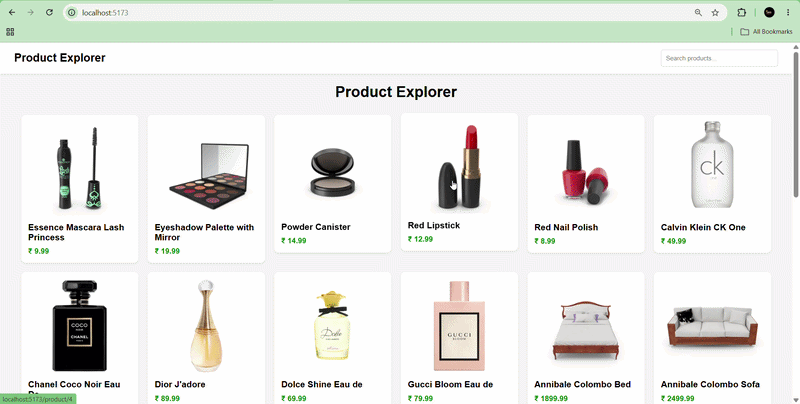

# 📑 Daily Task Submission Report
**MERN Stack Internship | Prelytix Private Limited**

| Field | Details |
| :--- | :--- |
| **Student Name** | Sahil Belim |
| **Internship ID** | ND |
| **Date** | 2026-05-16 |
| **Course Day** | Day 4 |
| **GitHub Repo** | https://github.com/sahil2877/MERN_Internship |

---

# 🎯 Daily Objective

Today’s objective was to learn API handling in React and build a dynamic product-based web application using Fetch API, React Hooks, Routing, and reusable components.

---

# 🛠️ Implementation & Changes (Self-Documentation)

## 1. New Features / Logic Implemented

### ✅ Fetch API Integration
- **What:** Connected external Products API using Fetch API.
- **How:** Used `fetch()` inside `useEffect()` to request product data from DummyJSON API and stored it using `useState`.
- **Why:** To understand real-time API integration and dynamic rendering in React.

---

### ✅ Dynamic Product Rendering
- **What:** Displayed all products dynamically using `map()`.
- **How:** Stored API response in `products` state and rendered product cards using reusable `ProductCard` component.
- **Why:** To learn component-based architecture and dynamic UI rendering.

---

### ✅ Search Functionality
- **What:** Added real-time product search.
- **How:** Used `filter()` and `includes()` methods with search state.
- **Why:** To understand state-driven filtering and controlled inputs.

---

### ✅ Loading Spinner
- **What:** Added loading spinner while API data loads.
- **How:** Created separate Loader component and used conditional rendering.
- **Why:** To improve user experience during asynchronous operations.

---

### ✅ Dynamic Routing
- **What:** Implemented product details page using dynamic routes.
- **How:** Used React Router DOM with `/product/:id` route and `useParams()`.
- **Why:** To learn route parameters and dynamic navigation.

---

### ✅ Single Product API Fetch
- **What:** Fetched individual product details.
- **How:** Created dynamic API URL using product ID from URL params.
- **Why:** To understand single resource fetching and detailed views.

---

# 2. UI/UX Enhancements

- Created responsive product cards layout.
- Added hover effect on product cards.
- Added rounded corners and shadows for cleaner UI.
- Implemented responsive flex layout for products.
- Designed clean navigation bar with search box.
- Added professional spacing and alignment.

---

# 3. API / Frontend Updates

### API Used:
```txt
https://dummyjson.com/products
```

### Single Product API:
```txt
https://dummyjson.com/products/:id
```

### React Concepts Used:
- useState
- useEffect
- fetch API
- map()
- filter()
- props
- conditional rendering
- React Router
- useParams
- Link

---

# 💻 Code Snippet: My Primary Contribution

```javascript
useEffect(() => {

  fetch(url)

    .then(response => response.json())

    .then(data => {

      setProducts(data.products)

      setLoading(false)

    })

    .catch(error => {

      console.log(error)

      setLoading(false)

    })

}, [])
```

### Explanation:
This code fetches product data from API when the page loads and stores it inside React state using `setProducts()`.

---
# 📸 Screenshots / Proof of Work

## UI Screenshot
> 

---

## Search Functionality Screenshot
> 

---

## Search Result Screenshot
> 

---

## Product Details Page Screenshot
> 

---

## API Console Output
> 

## 🎥 Demo



---

# 🛑 Challenges Faced & Solutions

### Problem:
When searching a single product, the product card became too large and images stretched.

### Solution:
Replaced CSS Grid layout with Flexbox and added fixed width to cards.

---

### Problem:
Loading state was not handled properly initially.

### Solution:
Created separate loading state and Loader component using conditional rendering.

---

# 💡 Key Learnings

- Learned real API integration in React.
- Understood how Fetch API works.
- Learned useState and useEffect practically.
- Learned dynamic routing using React Router.
- Understood reusable component structure.
- Learned search filtering using filter() and includes().
- Learned conditional rendering and loading states.

---

# 🔗 Live Preview (If applicable)

- **Deployment Link:** [Add Vercel Link Here]

---

# 📂 Project Features

✅ Product API Fetching  
✅ Dynamic Product Cards  
✅ Responsive Layout  
✅ Search Functionality  
✅ Loading Spinner  
✅ Product Details Page  
✅ Dynamic Routing  
✅ React Router DOM  
✅ Single Product API Fetch  
✅ Reusable Components  

---

# 🧠 Project Flow

```txt
Fetch API
   ↓
JSON Response
   ↓
Store in State
   ↓
map() Rendering
   ↓
Product Cards UI
   ↓
Dynamic Routing
   ↓
Single Product Details
```

---

# 🚀 Technologies Used

- React JS
- Vite
- JavaScript
- CSS
- React Router DOM
- Fetch API

---

**Signature:**  
*Sahil Belim*
