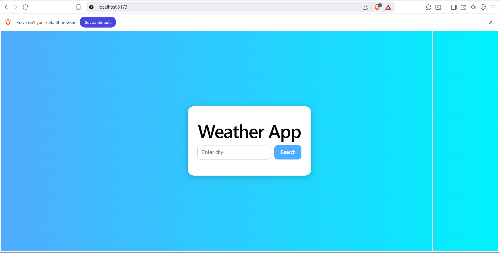
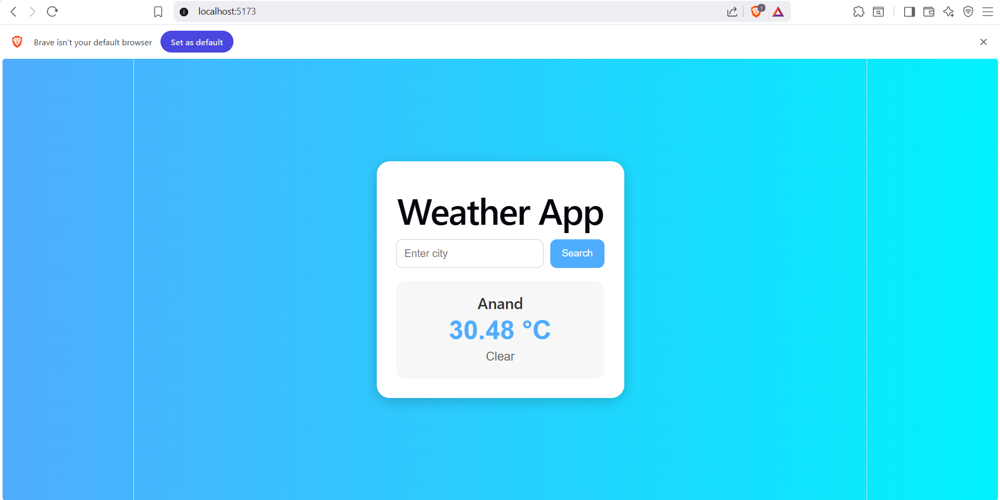

# 📑 Day 7 Task Submission Report

**MERN Stack Internship | Prelytix Private Limited**

| Field             | Details |
| :---------------- | :------ |
| **Student Name**  | Sahil Belim |
| **Internship ID** | ND |
| **Date**          | 2026-05-26 |
| **Course Day**    | Day 7 |
| **GitHub Repo**   | https://github.com/sahil2877/MERN_Internship |

---

# 🎯 Daily Objective

> Learn and implement React Custom Hooks by building a Weather Search App with reusable logic and API integration.

---

# 🛠️ Implementation & Changes (Self-Documentation)

## 1. New Features / Logic Implemented

* **What:** Built a Weather Search App using React Custom Hooks.

* **How:**

  * Created reusable custom hook `useWeather`.
  * Implemented weather API fetching.
  * Managed loading and error states using `useState`.
  * Created reusable React components:

    * WeatherForm
    * WeatherCard
  * Implemented dynamic weather rendering.
  * Added conditional rendering for loading and errors.

* **Why:**

  * To understand reusable logic sharing and API handling using React Custom Hooks.

---

## 2. UI/UX Enhancements

* Added modern gradient background UI.
* Added responsive weather dashboard card.
* Added hover effects on buttons.
* Added proper spacing and clean layout.
* Added loading and error messages.

---

## 3. Database / Backend Updates

* No backend or database integration was required for Day 7 tasks.

---

# 💻 Code Snippet: My Primary Contribution

```jsx
function useWeather() {

   const [weather, setWeather] = useState(null);
   const [loading, setLoading] = useState(false);

   const fetchWeather = async (city) => {

      setLoading(true);

      const response = await fetch(
         `https://api.openweathermap.org/data/2.5/weather?q=${city}`
      );

      const data = await response.json();

      setWeather(data);

      setLoading(false);
   };

   return {
      weather,
      loading,
      fetchWeather
   };
}
```

This custom hook was used to manage reusable weather fetching logic across components.

---

# 📸 Screenshots / Proof of Work

## Weather Dashboard UI

>

>

---

# 🛑 Challenges Faced & Solutions

## Problem

* Managing API logic inside components made the code repetitive.

## Solution

* Extracted reusable API logic into custom hook `useWeather`.

---

## Problem

* Weather data was not rendering correctly initially.

## Solution

* Used React state updates and conditional rendering properly.

---

# 💡 Key Learnings

* Learned React Custom Hooks.
* Learned API integration in React.
* Learned reusable state management.
* Learned loading and error handling.
* Learned component-based architecture.
* Learned conditional rendering.

---

# 🔗 Live Preview

* Deployment not done yet.

---

**Signature:**  
Sahil Belim