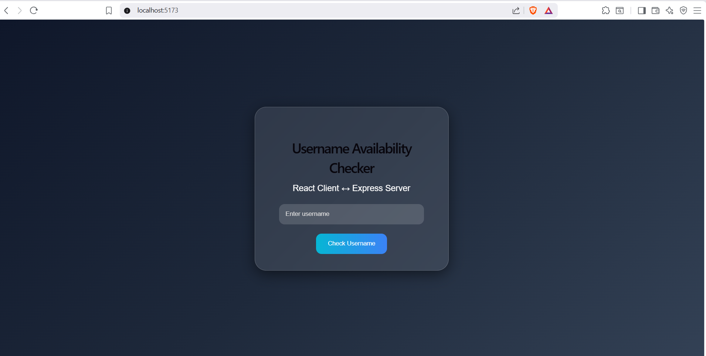
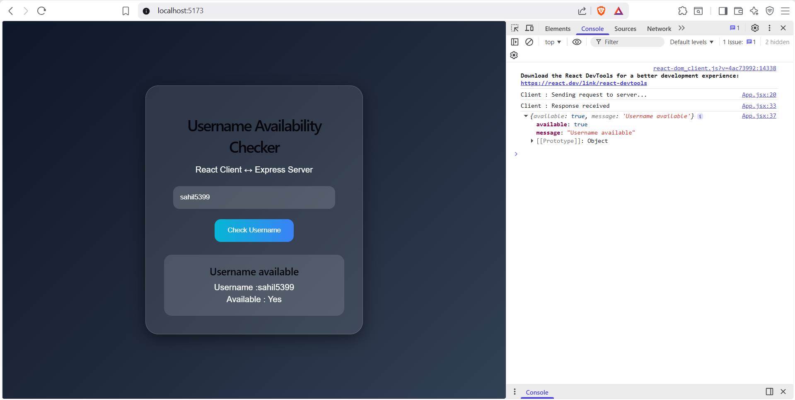
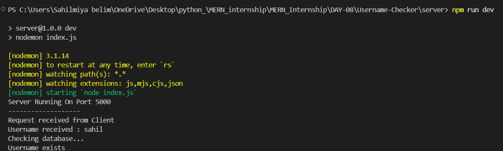

# 📑 Day 8 Task Submission Report

**MERN Stack Internship | Prelytix Private Limited**

| Field             | Details              |
| :---------------- | :------------------- |
| **Student Name**  | Sahil Belim          |
| **Internship ID** | ND                   |
| **Date**          | 2026-05-20           |
| **Course Day**    | Day 8                |
| **GitHub Repo**   | https://github.com/sahil2877/MERN_Internship |

---

# 🎯 Daily Objective

> Understand Client-Server Architecture and implement frontend-backend communication using React and Express JS.

---

# 🛠️ Implementation & Changes (Self-Documentation)

## 1. New Features / Logic Implemented

**What:**

Built a Username Availability Checker project using React and Express JS.

**How:**

* Created Express backend server using Node.js
* Configured API route using Express
* Implemented React frontend using Vite
* Connected frontend and backend using Axios
* Used async-await for API communication
* Added username validation logic
* Implemented loading state handling
* Displayed dynamic server response
* Enabled CORS middleware

**Why:**

To understand request-response workflow and real-world client-server communication.

---

## 2. UI/UX Enhancements

* Added glassmorphism UI
* Added responsive design
* Added dynamic response card
* Added loading state
* Added interactive button effects

---

## 3. Database / Backend Updates

Created Express server on:

```text
http://localhost:5000
```

Configured API endpoint:

```text
POST http://localhost:5000/api/username
```

Implemented JSON response handling.

---

# 💻 Code Snippet: My Primary Contribution

```jsx
const response = await axios.post(
"http://localhost:5000/api/username",
{
   username:username
}
)

setData(response.data)
```

Used to establish communication between React client and Express server.

---

# 📸 Screenshots / Proof of Work

## Initial UI



---

## Username Response Display



---

## Express Server Running



---

# 🛑 Challenges Faced & Solutions

## Problem

Frontend was unable to communicate with backend.

## Solution

Configured Express server properly and enabled CORS middleware.

---

## Problem

Network error occurred during API communication.

## Solution

Started backend server properly and verified API routes.

---

# 💡 Key Learnings

* Client-Server Architecture
* React and Express integration
* API communication
* Request-response cycle
* Axios handling
* CORS setup
* Async-await usage

---

# 🔗 Live Preview

Deployment not done yet.

---

**Signature:**
Sahil Belim
