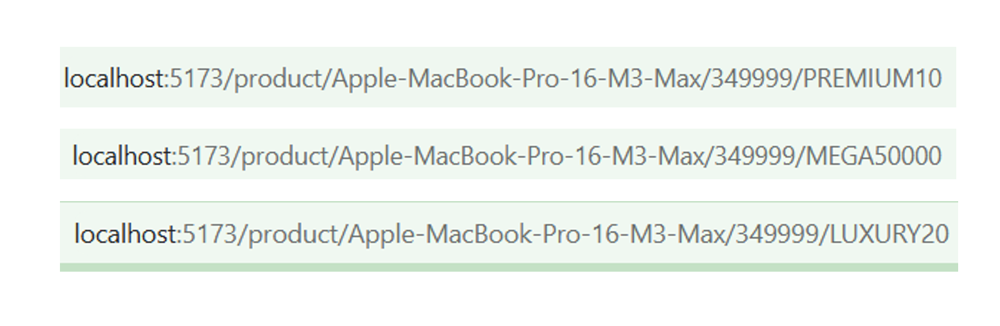
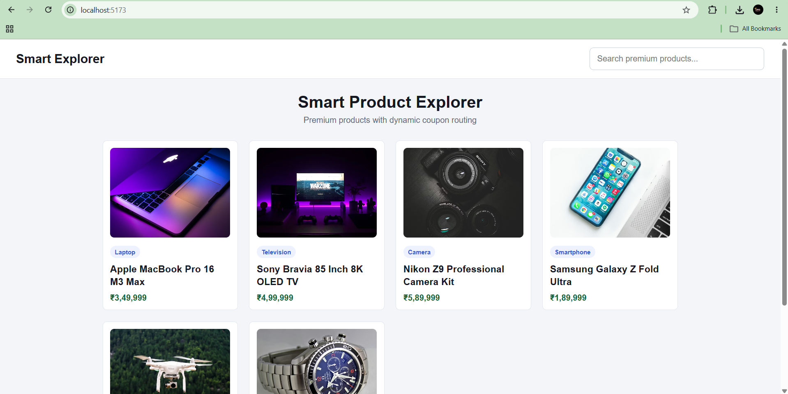
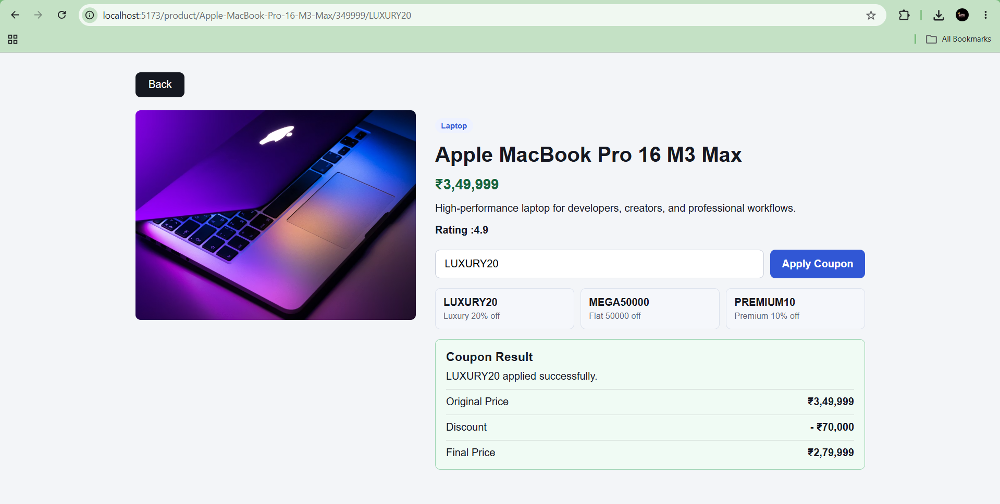
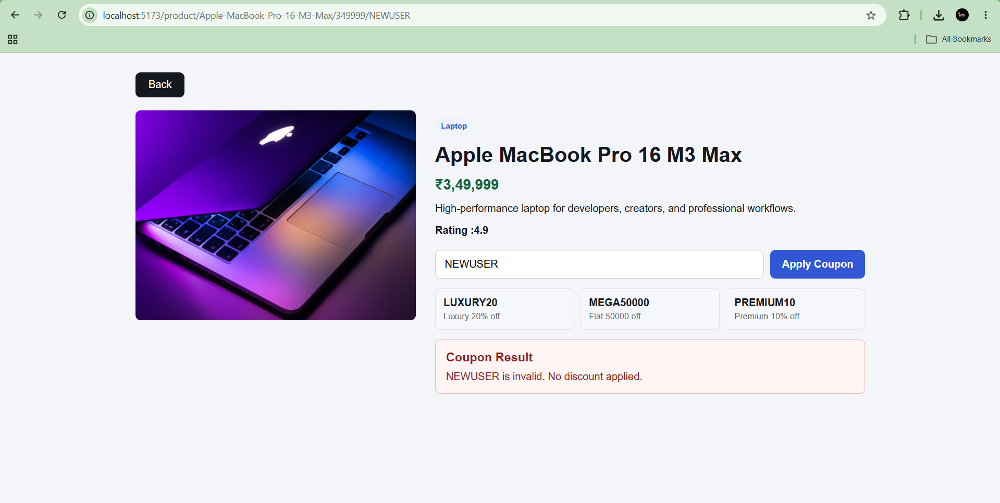

# 📑 Day 9 Task Submission Report

**MERN Stack Internship | Prelytix Private Limited**

| Field             | Details               |
| :---------------- | :-------------------- |
| **Student Name**  | sahil belim           |
| **Internship ID** | ND                    |
| **Date**          | 2026-05-21            |
| **Course Day**    | Day 9                 |
| **GitHub Repo**   | [sahil2877/MERN_Internship](https://github.com/sahil2877/MERN_Internship) |

---

# 🎯 Daily Objective

> Understand React Routing and Route Parameters by creating a Smart Product Explorer where products open through dynamic URLs and coupons are applied using route-based coupon codes.

---

# 🛠️ Implementation & Changes (Self-Documentation)

## 1. New Features / Logic Implemented

* **What:** Built a Smart Product Explorer with Dynamic Coupon Routing using React Router DOM.

* **How:**

  * Installed and configured `react-router-dom`.
  * Created product listing page with premium high-price products.
  * Added dynamic product detail route using product name and price.
  * Used `useParams()` hook to read URL values.
  * Created dynamic routes:

    * Product details route
    * Product name route parameter
    * Product price route parameter
    * Coupon code route parameter

  * Added coupon validation logic.
  * Displayed discount, original price, and final price for valid coupons.
  * Displayed proper error messages for invalid or unavailable coupons.
  * Added coupon shortcut buttons for available coupons.

* **Why:**

  * To understand dynamic route parameters, URL-based rendering, and coupon result handling in React applications.

---

## 2. UI/UX Enhancements

* Added clean product card layout.
* Added responsive product grid.
* Added search functionality by product name and category.
* Added product details page with image, price, category, rating, and description.
* Added coupon input form.
* Added highlighted coupon result section.
* Added different UI styles for valid and invalid coupon results.
* Added mobile responsive design.

---

## 3. Database / Backend Updates

* No backend or database integration was required for Day 9 tasks.
* Product and coupon data were managed locally inside `src/data/products.js`.

---

# 💻 Code Snippet: My Primary Contribution

```jsx
const {
  productName,
  price,
  couponCode
} = useParams()
```

This hook was used to access dynamic URL parameters and display product details with coupon-based results.

---

# 🔗 Dynamic Routes Used

## Product Details Route

```txt
/product/:productName/:price
```

## Coupon Apply Route

```txt
/product/:productName/:price/:couponCode
```

## Example Valid Coupon Route

```txt
/product/Apple-MacBook-Pro-16-M3-Max/349999/LUXURY20
```

## Example Invalid Coupon Route

```txt
/product/Apple-MacBook-Pro-16-M3-Max/349999/INVALID50
```

---

# 🎟️ Coupon Logic

| Coupon Code | Discount | Minimum Price |
| :---------- | :------- | :------------ |
| **PREMIUM10** | 10% off | ₹1,00,000 |
| **LUXURY20** | 20% off | ₹2,50,000 |
| **MEGA50000** | Flat ₹50,000 off | ₹3,00,000 |
| **TECH25** | 25% off | ₹1,50,000 |

---

# 📸 Screenshots / Proof of Work

## Product Listing Page



---

## Product Details Route



---

## Valid Coupon Applied



---

## Invalid Coupon Handling



---

# 🛑 Challenges Faced & Solutions

## Problem

* Product details needed to open dynamically using product name and price in the URL.

## Solution

* Used React Router DOM route parameters and `useParams()` hook to read product name and price from the URL.

---

## Problem

* Coupon result needed to change based on the coupon code written in the URL.

## Solution

* Added dynamic coupon route parameter and created coupon validation logic to check valid, invalid, and unavailable coupons.

---

## Problem

* Price calculation needed to work correctly for percentage and flat discounts.

## Solution

* Created separate coupon logic for percentage-based and flat discount coupons.

---

# 💡 Key Learnings

* Learned React Router DOM.
* Learned dynamic route parameters.
* Learned `useParams()` hook usage.
* Learned URL-based product rendering.
* Learned coupon code validation using route params.
* Learned conditional rendering for valid and invalid results.
* Learned local data handling in React.
* Learned responsive UI design with CSS.

---

# 🔗 Live Preview

* Deployment not done yet.
* Local preview:

```txt
http://localhost:5173
```

---

**Signature:**
sahil belim
