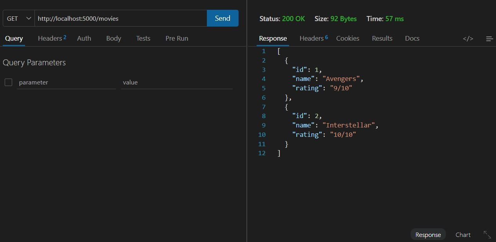
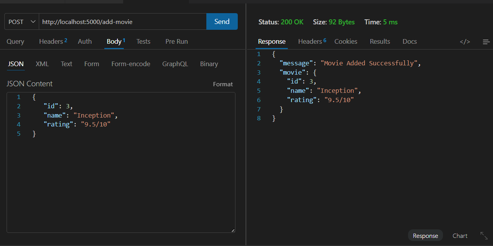
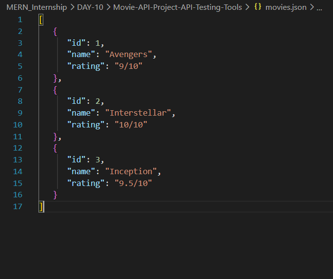

# 📑 Day 10 Task Submission Report

**MERN Stack Internship | Prelytix Private Limited**

| Field             | Details               |
| :---------------- | :-------------------- |
| **Student Name**  | sahil belim           |
| **Internship ID** | ND                    |
| **Date**          | 2026-05-27            |
| **Course Day**    | Day 10                |
| **GitHub Repo**   | https://github.com/sahil2877/MERN_Internship |

---

# 🎯 Daily Objective

> Learn API Testing concepts using Express JS APIs and practice backend request-response handling using Thunder Client / Postman.

---

# 🛠️ Implementation & Changes (Self-Documentation)

## 1. New Features / Logic Implemented

### What:

Built a Movie Management Backend API using Express JS.

### How:

- Created Express server using Node.js.
- Implemented GET API to fetch movie records.
- Implemented POST API to add new movies.
- Used `express.json()` middleware for JSON request handling.
- Stored movie data inside `movies.json` file.
- Tested APIs using Thunder Client / Postman.

### Why:

To understand backend API creation, request-response workflow, and API testing concepts.

---

## 2. UI/UX Enhancements

- No frontend UI was required for Day 10 tasks.
- Focus was on backend APIs and testing.

---

## 3. Database / Backend Updates

### Created Express Server on Port 5000

### Implemented APIs:

- `GET /movies`
- `POST /add-movie`

### Data Storage:

- Stored and updated movie records inside `movies.json` file.

---

# 💻 Code Snippet: My Primary Contribution

```js
app.post("/add-movie", (req, res) => {

   const newMovie = req.body

   movies.push(newMovie)

   fs.writeFileSync(
      "movies.json",
      JSON.stringify(movies, null, 3)
   )

   res.json({
      message: "Movie Added Successfully"
   })

})
```

This API receives movie data from Thunder Client / Postman and stores it inside the backend JSON file.

---

# 📸 Screenshots / Proof of Work

## GET API Response



---

## POST API Response



---

## Updated movies.json File



---

# 🛑 Challenges Faced & Solutions

## Problem

POST request body data was not being received correctly.

## Solution

Added `express.json()` middleware to parse JSON request body.

---

## Problem

Movie data was not updating inside JSON file.

## Solution

Implemented file handling using Node.js `fs` module.

---

# 💡 Key Learnings

- Learned backend API development
- Learned API testing using Thunder Client / Postman
- Learned GET and POST request handling
- Learned Express middleware usage
- Learned JSON file handling
- Learned backend request-response workflow

---

# 🔗 Live Preview

- Deployment not done yet.

---

# ✍️ Signature

sahil belim