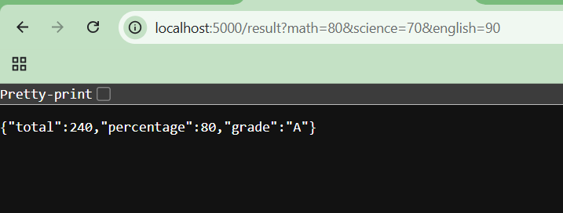
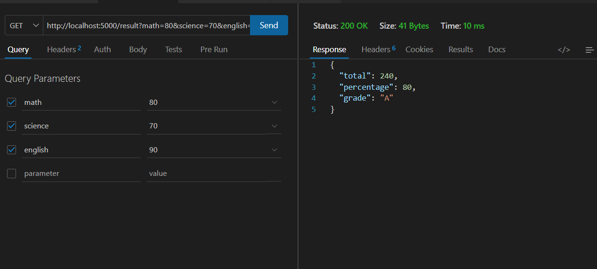
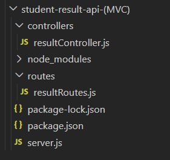
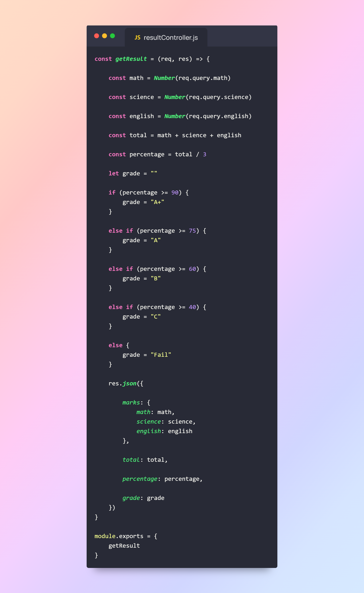

# 📑 Day 11 Task Submission Report

**MERN Stack Internship | Prelytix Private Limited**

| Field             | Details                                            |
| :---------------- | :------------------------------------------------- |
| **Student Name**  | sahil belim                                        |
| **Internship ID** | ND                                                 |
| **Date**          | 2026-05-25                                         |
| **Course Day**    | Day 11                                             |
| **GitHub Repo**   | https://github.com/sahil2877 |

---

# 🎯 Daily Objective

> Understand MVC Architecture and Query Parameters by creating modular Express APIs using routes and controllers.

---

# 🛠️ Implementation & Changes (Self-Documentation)

## 1. New Features / Logic Implemented

### What

Built a Student Result Management API using MVC Architecture in Express JS.

### How

* Created separate folders for routes and controllers.
* Implemented modular backend structure.
* Created dynamic Result API.
* Used Query Parameters for student marks.
* Accessed values using `req.query`.
* Calculated:

  * Total Marks
  * Percentage
  * Grade
* Returned JSON response.
* Tested APIs using browser and Postman.

### Why

To understand clean backend architecture and dynamic API handling using query parameters.

---

# 💻 API Example

## Request

```text
/result?math=80&science=70&english=90
```

## Response

```json
{
  "marks": {
    "math": 80,
    "science": 70,
    "english": 90
  },
  "total": 240,
  "percentage": 80,
  "grade": "A"
}
```

---

# 💻 Code Snippet: My Primary Contribution

```js
const math = Number(req.query.math)

const science = Number(req.query.science)

const english = Number(req.query.english)

const total = math + science + english

const percentage = total / 3
```

This logic was used to dynamically read query parameters and calculate student results.

---


# 📸 Screenshots / Proof of Work

## Result API Response



---

## Postman API Testing



---

## MVC Folder Structure



---

## Controller Logic




---

# 🛑 Challenges Faced & Solutions

## Problem

Query parameter values were treated as strings initially.

## Solution

Converted values into numbers using `Number()` function.

---

## Problem

Backend code became difficult to manage in a single file.

## Solution

Implemented MVC Architecture using separate routes and controllers.

---

# 💡 Key Learnings

* Learned MVC Architecture concepts.
* Learned modular backend development.
* Learned Query Parameters handling.
* Learned `req.query` usage.
* Learned Express routing concepts.
* Learned controller-based API structure.
* Learned dynamic API response handling.

---

# 🔗 Live Preview

* Deployment not done yet.

---

# ✍️ Signature

sahil belim
