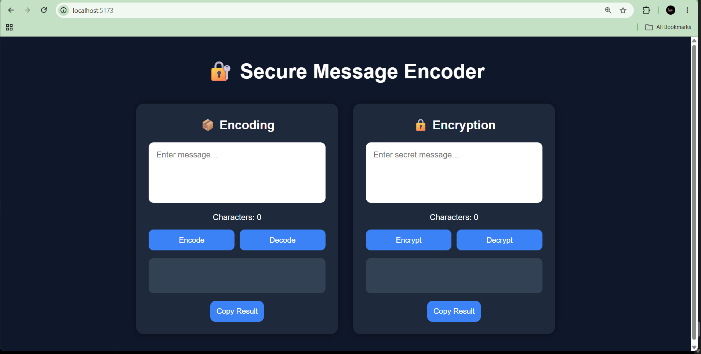
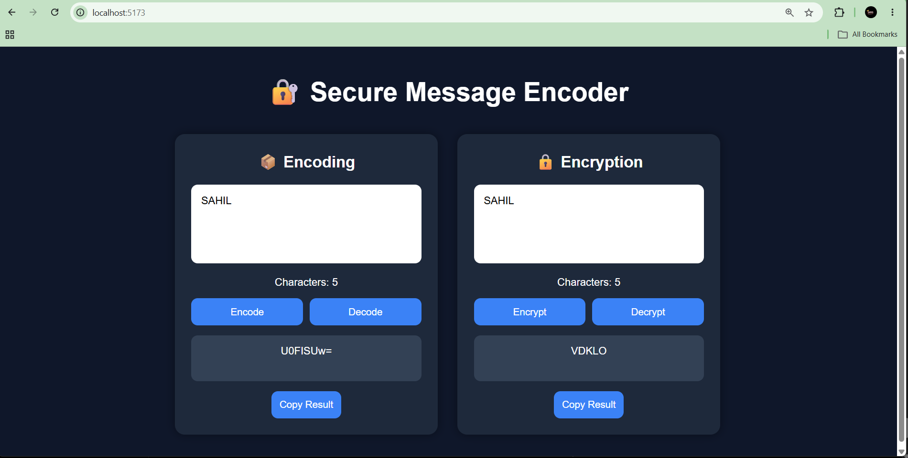
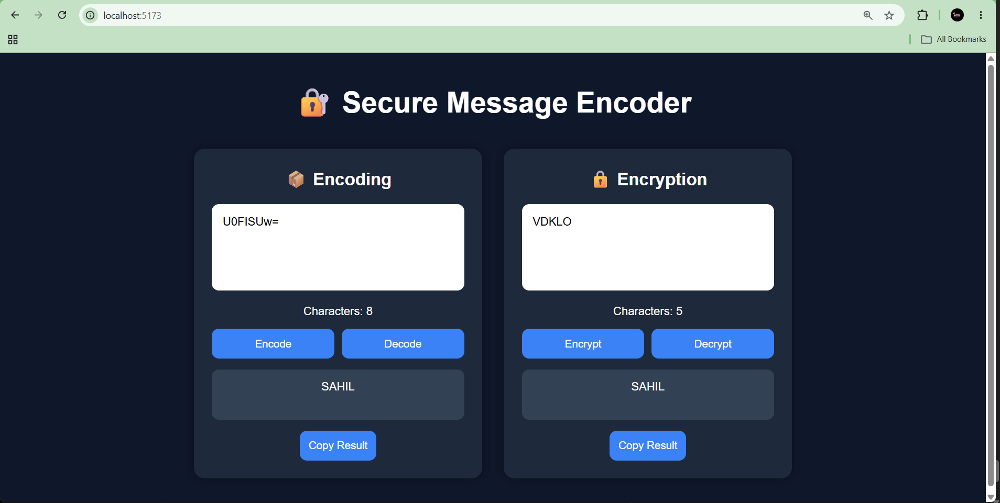

# 📑 Daily Task Submission Report

**MERN Stack Internship | Prelytix Private Limited**

| Field             | Details                          |
| :---------------- | :------------------------------- |
| **Student Name**  | Sahil Belim                      |
| **Internship ID** | ND              |
| **Date**          | 2026-05-28                       |
| **Course Day**    | Day 12                           |
| **GitHub Repo**   | https://github.com/sahil2877/MERN_Internship |

---

# 🎯 Daily Objective

Today’s objective was to understand the concepts of Encoding and Encryption and implement them practically by building a mini React application.

The goal was to:

* Learn Base64 Encoding and Decoding
* Understand Caesar Cipher Encryption
* Build a secure message utility tool
* Practice React state management and event handling
* Improve frontend UI design skills

---

# 🛠️ Implementation & Changes (Self-Documentation)

## 1. New Features / Logic Implemented

### ✅ Encoding & Decoding Logic

* Implemented Base64 Encoding using JavaScript `btoa()` function.
* Implemented Base64 Decoding using JavaScript `atob()` function.

### ✅ Encryption & Decryption Logic

* Created a Caesar Cipher encryption algorithm.
* Shifted each character by +3 ASCII values during encryption.
* Reversed the shift by -3 during decryption.

### ✅ Clipboard Functionality

* Added Copy Result button using Clipboard API.
* Users can instantly copy encoded or encrypted messages.

### ✅ Character Counter

* Added live character counting feature for better UI interaction.

---

## 2. UI/UX Enhancements

* Designed modern dark-themed responsive UI.
* Added separate cards for Encoding and Encryption.
* Implemented hover effects on buttons.
* Added output display containers.
* Used flexbox for responsive layout alignment.

---

## 3. Database / Backend Updates

* No backend/database was used in this project.
* This mini project was fully frontend-based using React.

---

# 💻 Code Snippet: My Primary Contribution

```javascript
const encryptText = () => {
  let encrypted = "";

  for (let i = 0; i < text.length; i++) {
    encrypted += String.fromCharCode(text.charCodeAt(i) + 3);
  }

  setResult(encrypted);
};
```

---

# 📸 Screenshots / Proof of Work

## Main UI Interface



---

## Encoding & Encryption Result



---

## Decoding & Decryption Result




---

# 🛑 Challenges Faced & Solutions

### Problem:

While implementing decoding functionality, invalid encoded text caused application errors.

### Solution:

Used `try-catch` block to handle invalid decoding input safely and display proper error messages.

---

### Problem:

Text overflow inside output container.

### Solution:

Used CSS `word-wrap: break-word` property to properly display long encrypted messages.

---

# 💡 Key Learnings

* Learned the difference between Encoding and Encryption.
* Understood Base64 conversion techniques.
* Learned how Caesar Cipher encryption works.
* Improved React `useState` handling.
* Learned Clipboard API usage.
* Improved frontend UI styling and responsiveness.

---

# 🔗 Live Preview (If applicable)

* Deployment Link: [Add Deployment URL Here]

---

# 📌 Conclusion

This project helped me understand the practical implementation of Encoding and Encryption concepts using React. I also improved my frontend development skills and learned how to build secure message transformation utilities.

---

**Signature:**
Sahil Belim
