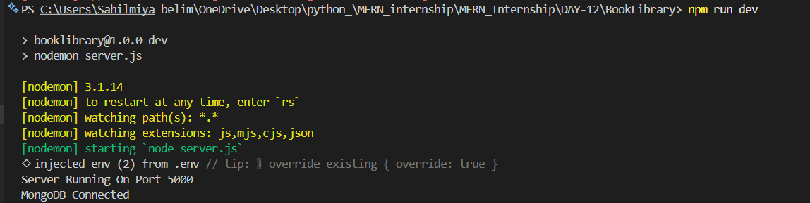
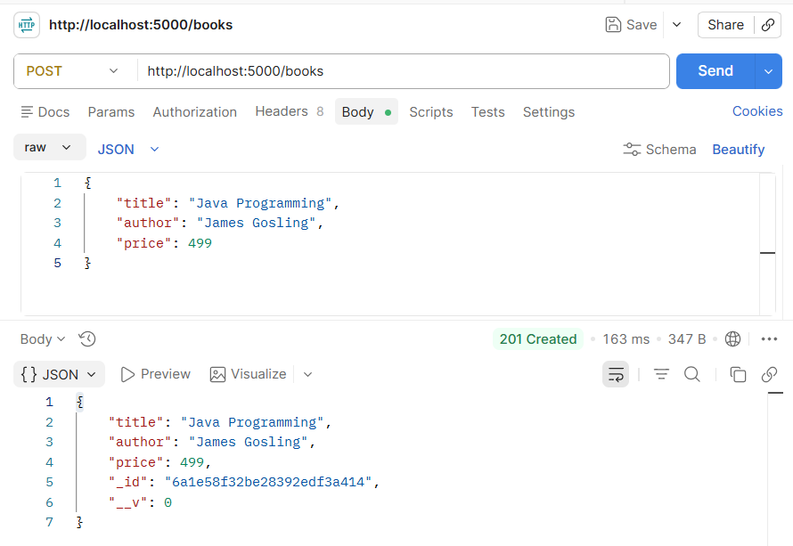
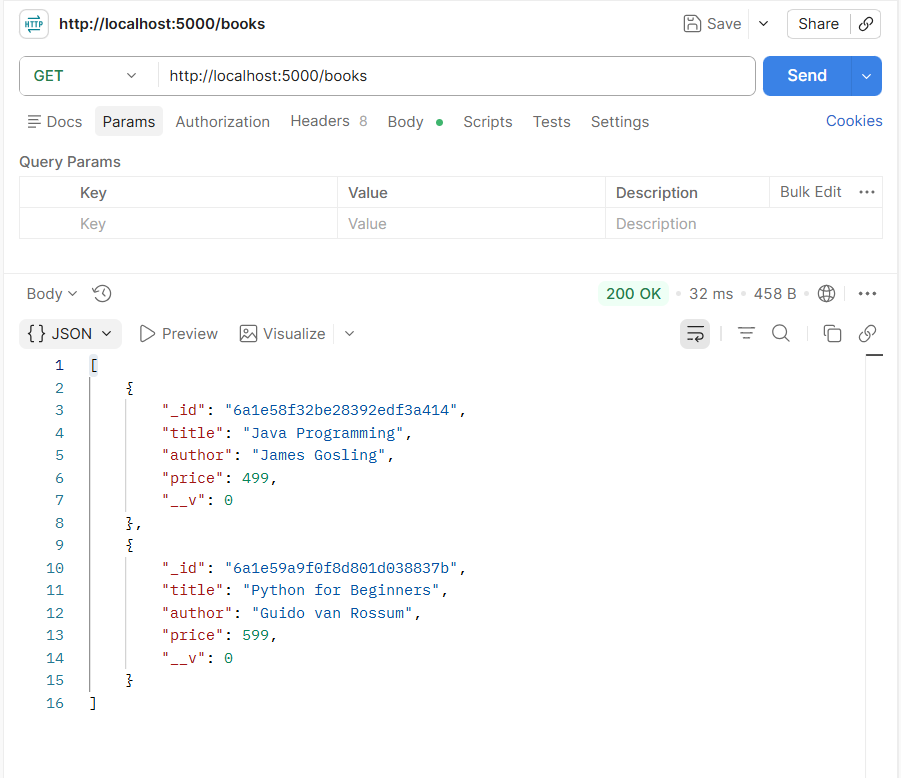
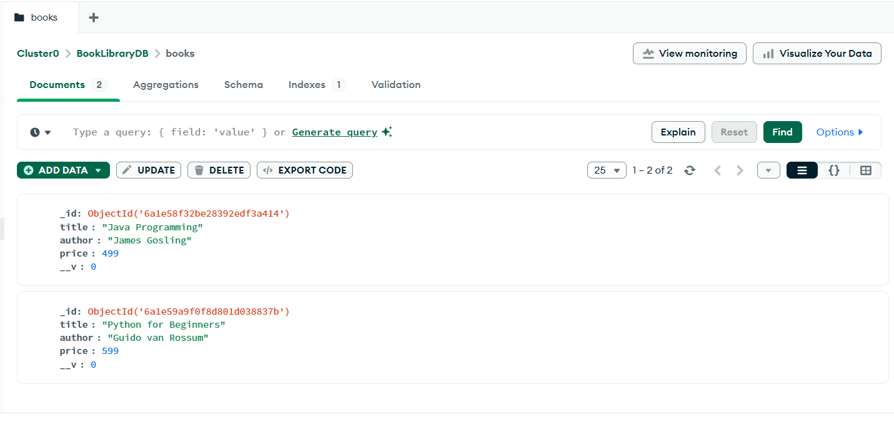

# 📑 Day 12 Task Submission Report

**MERN Stack Internship | Prelytix Private Limited**

| Field             | Details                     |
| :---------------- | :-------------------------- |
| **Student Name**  | Sahil Belim                 |
| **Internship ID** | ND                          |
| **Date**          | 2026-05-27                  |
| **Course Day**    | Day 12                      |
| **GitHub Repo**   | https://github.com/sahil2877/MERN_Internship |

---

# 🎯 Daily Objective

> Understand MongoDB Atlas integration and implement MVC Architecture using Express JS, Mongoose, Controllers, Routes, and Models for database operations.

---

# 🛠️ Implementation & Changes (Self-Documentation)

## 1. New Features / Logic Implemented

* **What:** Built a Book Library Backend using MongoDB Atlas and MVC Architecture.

* **How:**

  * Created MongoDB Atlas Cluster and connected it with Node.js backend.
  * Configured environment variables using `.env` file.
  * Implemented MVC Architecture by creating separate folders:

    * Models
    * Controllers
    * Routes
    * Config
  * Created Book Schema using Mongoose.
  * Implemented Create Book API using `POST` request.
  * Implemented Get All Books API using `GET` request.
  * Connected Express Server with MongoDB Atlas database.
  * Tested APIs using Postman.

* **Why:**

  * To learn cloud database integration and build scalable backend applications using MVC Architecture.

---

## 2. UI/UX Enhancements

* No frontend implementation was required.
* Focus was on backend architecture and API development.

---

## 3. Database / Backend Updates

* Connected MongoDB Atlas using Mongoose.

* Created Book Collection in MongoDB Atlas.

* Implemented APIs:

  * `POST /books`
  * `GET /books`

* Stored book information inside MongoDB Atlas database.

* Implemented secure database connection using environment variables.

---

# 💻 Code Snippet: My Primary Contribution

```js
const book = new Book({
    title: req.body.title,
    author: req.body.author,
    price: req.body.price
});

const savedBook = await book.save();

res.status(201).json(savedBook);
```

This logic was used to save book information into MongoDB Atlas database using Mongoose.

---

# 📸 Screenshots / Proof of Work

## MongoDB Atlas Connected Successfully



---

## Create Book API Response



---

## Get Books API Response



---

## MongoDB Atlas Collection Data



---

# 🛑 Challenges Faced & Solutions

## Problem

* MongoDB Atlas authentication failed during database connection.

## Solution

* Corrected database user credentials and updated MongoDB connection string properly.

---

## Problem

* API requests were not storing data initially.

## Solution

* Configured Mongoose Model correctly and connected Controllers with Routes.

---

## Problem

* MongoDB Atlas user authentication was failing.

## Solution

* Used the correct Atlas database user and updated credentials in `.env` file.

---

# 💡 Key Learnings

* Learned MongoDB Atlas Integration.
* Learned Mongoose Models and Schemas.
* Learned MVC Architecture.
* Learned Express Routing.
* Learned Controller-based API Structure.
* Learned Environment Variable Configuration.
* Learned MongoDB CRUD Operations.
* Learned API Testing using Postman.
* Learned Cloud Database Connectivity.

---

# 🔗 Live Preview

* Deployment not done yet.

---

**Signature:**

Sahil Belim
