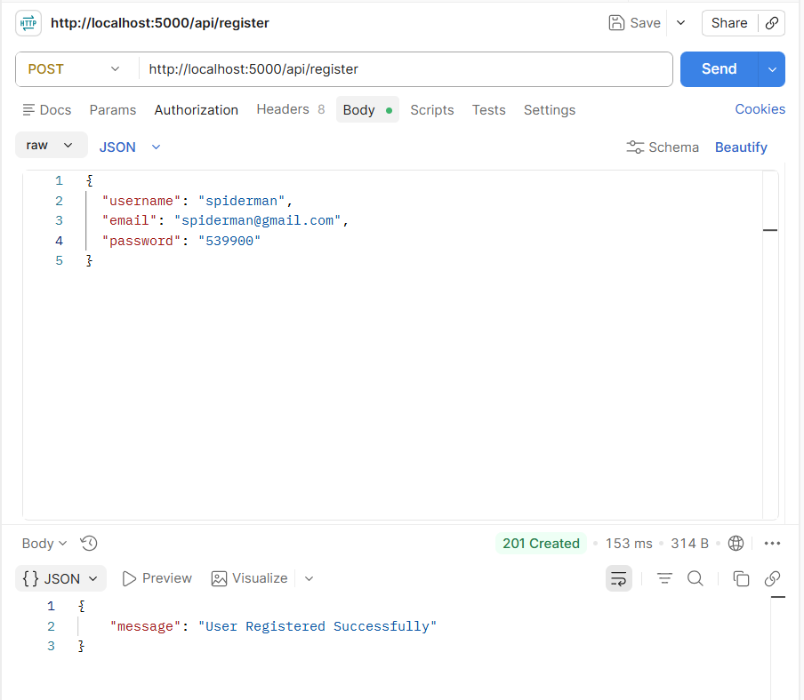
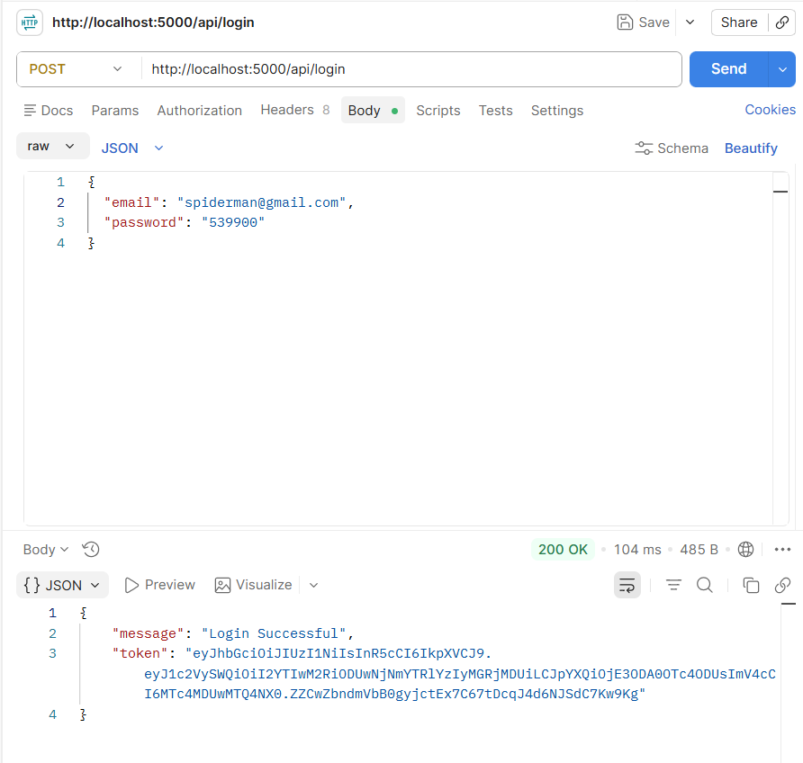
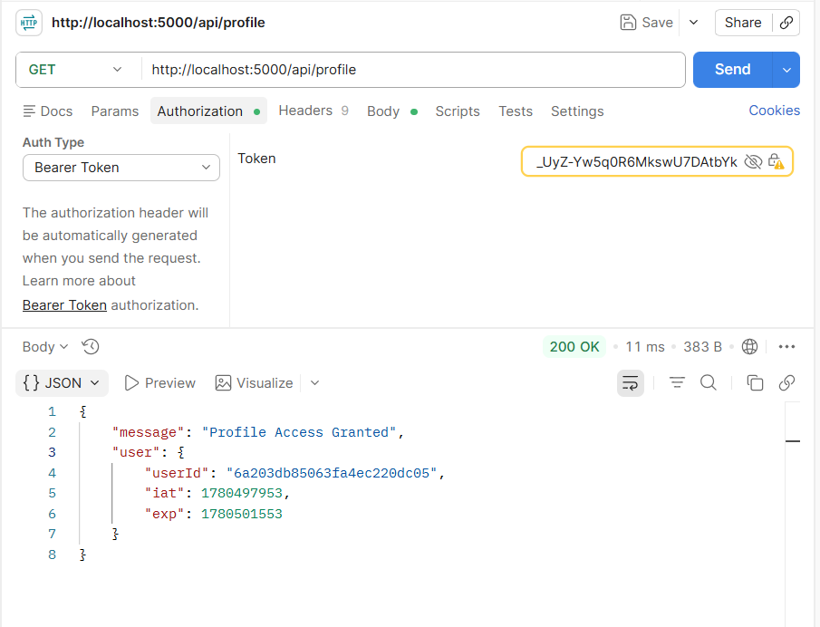
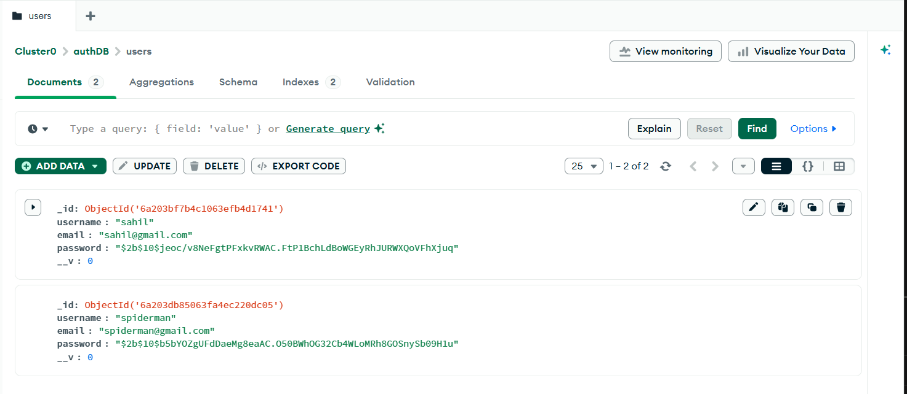

# 📑 Day 14 Task Submission Report

**MERN Stack Internship | Prelytix Private Limited**

| Field             | Details                     |
| :---------------- | :-------------------------- |
| **Student Name**  | sahil belim                 |
| **Internship ID** | ND                          |
| **Date**          | 2026-06-03                  |
| **Course Day**    | Day 14                      |
| **GitHub Repo**   | https://github.com/sahil2877/MERN_Internship |

---

# 🎯 Daily Objective

> Understand Authentication and Authorization concepts using JWT, Middleware, Password Hashing, and Protected Routes in Node.js applications.

---

# 🛠️ Implementation & Changes (Self-Documentation)

## 1. New Features / Logic Implemented

### What

Developed a complete JWT-based Authentication System using Express.js and MongoDB Atlas.

### How

* Created User Registration API.
* Created User Login API.
* Implemented Password Hashing using Bcrypt.
* Generated JWT Token after successful login.
* Implemented JWT Verification Middleware.
* Created Protected Profile Route.
* Tested APIs using Postman.

### Why

To understand how secure user authentication and authorization systems are implemented in real-world web applications.

---

## 2. Security Features Implemented

* Password Hashing using BcryptJS.
* JWT Token Generation.
* JWT Token Verification.
* Middleware Based Authentication.
* Protected Route Access Control.
* Environment Variable Configuration using .env.

---

## 3. Backend Updates

Implemented the following APIs:

### POST /api/register

Register a new user.

### POST /api/login

Authenticate user and generate JWT token.

### GET /api/profile

Protected route accessible only with valid JWT token.

---

# 💻 Code Snippet: My Primary Contribution

```js
const token = jwt.sign(
  {
    userId: user._id,
  },
  process.env.JWT_SECRET,
  {
    expiresIn: "1h",
  }
);
```

This code generates a secure JWT token after successful user authentication.

---

# 📸 Screenshots / Proof of Work

## Register API Response



---

## Login API Response with JWT Token



---

## Protected Route Access



---

## Authentication Project Structure


---

## MongoDB User Collection



---

# 🛑 Challenges Faced & Solutions

## Problem

Understanding JWT Authentication Flow.

## Solution

Implemented login functionality and tested JWT token generation and verification using Postman.

---

## Problem

Storing user passwords securely.

## Solution

Used BcryptJS hashing before saving passwords into MongoDB.

---

## Problem

Protecting routes from unauthorized access.

## Solution

Created middleware to verify JWT tokens before granting route access.

---

# 💡 Key Learnings

* Authentication Concepts
* Authorization Concepts
* Password Hashing using Bcrypt
* JWT Token Generation
* JWT Token Verification
* Middleware Implementation
* Protected Route Handling
* MongoDB Atlas Integration
* Environment Variable Management
* API Testing using Postman

---

# 🔗 Live Preview

* Deployment not done yet.

---

**Signature:**
sahil belim
