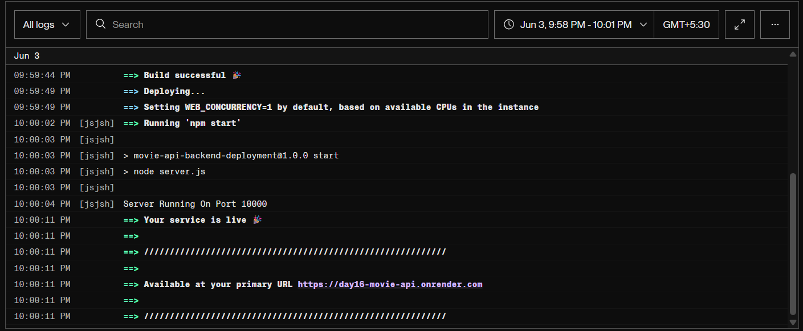
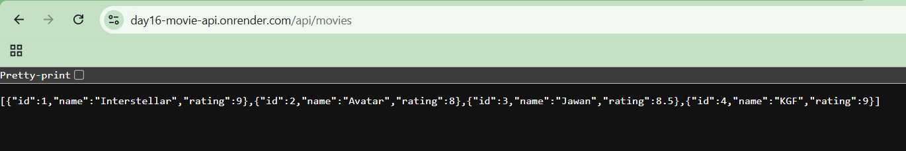
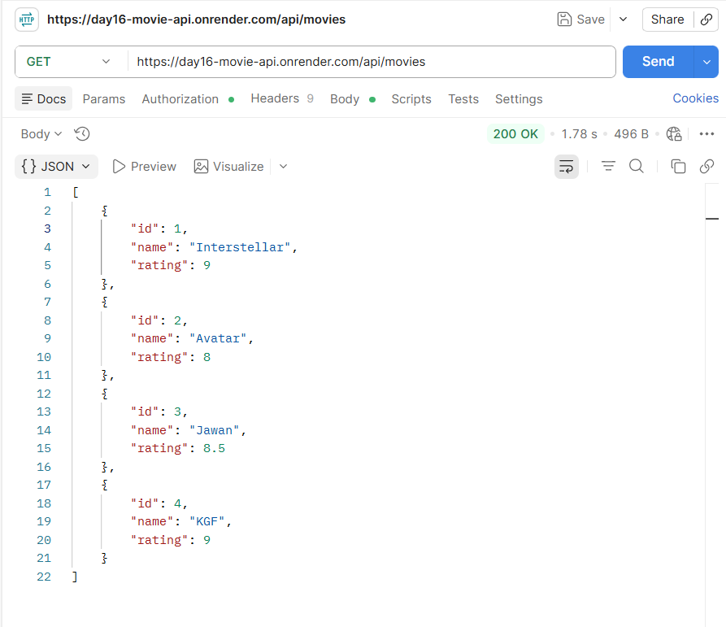

# 🎬 Movie API Backend Deployment

A simple Movie API built using **Node.js** and **Express.js**. This project demonstrates backend API creation, route handling, GitHub integration, and deployment on Render.

## 🚀 Live Demo

https://day16-movie-api.onrender.com

---

## 📌 Features

* Express.js Server Setup
* REST API Endpoints
* Movie Data Management
* Dynamic Route Parameters
* JSON Responses
* GitHub Integration
* Render Deployment

---

## 🛠️ Tech Stack

* Node.js
* Express.js
* Render
* GitHub

---

## 📂 Project Structure

```text
movie-api-backend-deployment
│
├── data
│   └── movies.js
│
├── routes
│   └── movieRoutes.js
│
├── server.js
├── package.json
├── package-lock.json
└── .gitignore
```

---

## 📡 API Endpoints

### Home Route

```http
GET /
```

Response:

```text
Movie API Server Running
```

---

### Get All Movies

```http
GET /api/movies
```

Response:

```json
[
  {
    "id": 1,
    "name": "Interstellar",
    "rating": 9
  }
]
```

---

### Get Movie By ID

```http
GET /api/movies/:id
```

Example:

```http
GET /api/movies/1
```

---

## ▶️ Run Locally

Clone the project:

```bash
git clone <repository-url>
```

Install dependencies:

```bash
npm install
```

Start server:

```bash
npm start
```

Server runs on:

```text
http://localhost:5000
```

---

## 🌐 Deployment

This project is deployed on Render.

Live URL:

https://day16-movie-api.onrender.com

---

## 📸 Screenshots

### Render Deployment Successful



---

### Browser Testing



---

### Postman API Testing



---

## 📚 Learning Outcomes

* Express.js server creation
* API route management
* Route parameters
* GitHub workflow
* Backend deployment process
* Render hosting platform
* Production API testing
